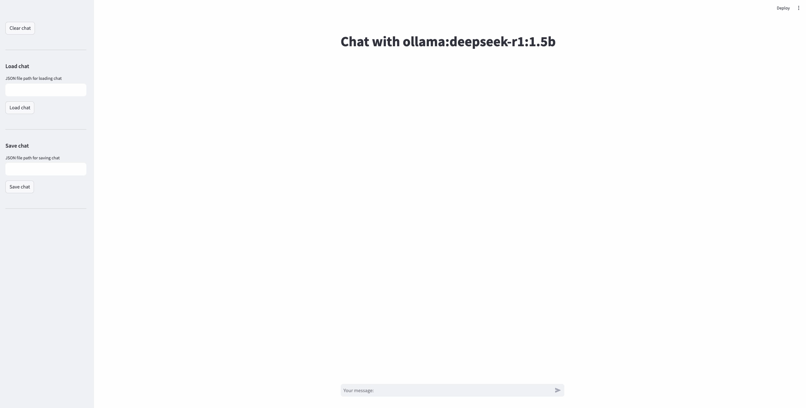

# A Simple Chat Interface for LLMs



Spin up your own chat interface locally with
```bash
./scripts/run_chat.sh --server openai --model_name gpt-4o-mini-2024-07-18
```

See `llm/__init__.py` for a list of supported LLM servers.

## Installation

We recommend miniconda3 and python3.12.
- OpenAI, Together.ai, Anthropic APIs work on both mac and linux.
- Ollama models are also supported, and you can add your own models. See Ollama models section.
- Huggingface models (in development) currently work on clusters with GPUs. Cluster-specific information is in `docs/`.

```bash
conda create -n llm_chat python=3.12
conda activate llm_chat
pip install -r requirements-linux.txt
# or 
pip install -r requirements-mac.txt
```

## Run the Chat interface

It is super easy to add your own LLM server by making simple changes to `llm/*`.
Currently the code supports the following LLM servers out-of-the-box:
- OpenAI
- Together.ai
- Anthropic
- Ollama
- Huggingface models

See the list of LLM servers in `llm/__init__.py`.
You can add your server to the list and create a corresponding `YourServerLLMChat(LLMChat)`
and the UI will recognize that as an option.

### LLMs through API access

To run the `gpt-4o-mini-2024-07-18` model from OpenAI, for example, do the following steps in a terminal:
1. Set the `$OPENAI_API_KEY` environment variable with your API key.
2. Run `./scripts/run_chat.sh --server openai --model_name gpt-4o-mini-2024-07-18`.
3. Open the website link in a browser and start chatting!

Analogously, run Together.ai and Anthropic models after setting `$TOGETHER_API_KEY` and `$ANTHROPIC_API_KEY` respectively.

### LLMs through Ollama
[Ollama](https://ollama.com/) provides a way to locally run LLMs on your machine (mac, linux, windows).
After downloading the software and setting up the CLI interface, you can download an LLM, say Llama 3.2 with 1B parameters with:
```bash
ollama pull llama3.2:1b
```

Then use the same model name to run the UI:
```bash
./scripts/run_chat.sh --server ollama --model_name ollama:llama3.2:1b
```

### LLMs through vLLM
[vLLM](https://docs.vllm.ai/) provides a way to locally run LLMs on your machine with GPUs.
Install vllm and serve the (downloaded) model through local API:
```bash
pip install vllm
vllm serve deepseek-ai/DeepSeek-R1-Distill-Qwen-32B --dtype auto --api-key token-abc123
```

Then use the same model name to run the UI:
```bash
OPENAI_API_KEY="token-abc123" ./scripts/run_chat.sh --server vllm --model_name deepseek-ai/DeepSeek-R1-Distill-Qwen-32B
```

Note that we set the `OPENAI_API_KEY` to the same API key we used to serve with `vllm`.
This is because `vllm` uses the OpenAI chat interface client to serve local LLMs.

### LLMs through Huggingface

**Note:** Only multimodal models like Llama3.2 supported for now, and only on [AIDA](docs/aida.md).
We will soon add support on [G2](docs/g2.md) cluster as well.
